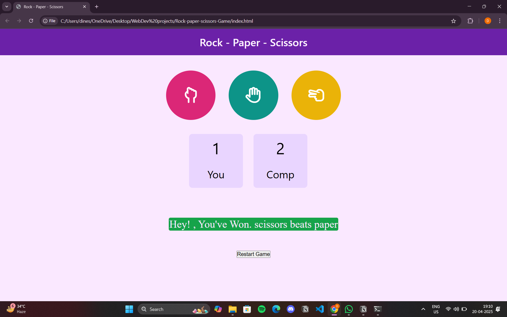

# 🪨 Rock-Paper-Scissors Game ✂️

A simple and interactive **Rock-Paper-Scissors** game built with **HTML**, **CSS**, and **JavaScript**. Play against the computer and test your luck!

## 🖼️ Preview

## 🎮 How to Play

- Click on either **Rock**, **Paper**, or **Scissors**.
- The computer will randomly select one of the three.
- The winner is determined by the classic rules:
  - Rock beats Scissors
  - Scissors beats Paper
  - Paper beats Rock
- The result and score are displayed instantly.

## 🛠️ Features

- Interactive UI with real-time game feedback
- Scoreboard for both player and computer
- Simple and clean layout
- Responsive design (works on mobile & desktop)

## 📂 Project Structure
    Rock-Paper-Scissors-Game/
│
├── index.html         # Main HTML file (game UI)
├── style.css          # Stylesheet for the game (colors, layout, fonts)
└── app.js             # JavaScript logic (gameplay, interaction)

## 💡 Technologies Used

- HTML5
- CSS3
- JavaScript (Vanilla)

## 📥 Installation

1. Clone the repository:
   git clone https://github.com/DineshPabboju/Rock-Paper-Scissors-Game.git
   
2.  Navigate to the project folder:
    cd Rock-Paper-Scissors-Game

3. Open index.html in your browser.

📄 License
This project is licensed under the MIT License.

🙌 Acknowledgements
Inspired by the classic game and built for learning and fun!

